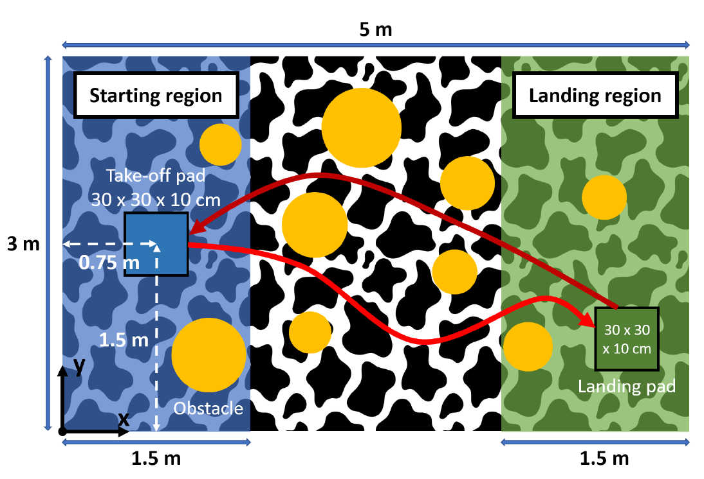

# uav-project
Drone project done part of the Aerial Robotics course at EPFL 

In this project, we programmed a Crazyflie drone to find and precisely land on a
platform with the help of minimal sensory information. Additionally, we used sensor readings to design a robust algorithm that can avoid obstacles present in the environment.

The arena for the final demonstration is shown in the figure above. The task you are required
to complete in this arena is composed of multiple phases:
* The drone takes off from a take-off pad placed within the starting region.
* Thanks to the optic-flow sensor and a z-range finder the drone can track its
movements and find the landing pad in the landing zone.
* Once the landing pad is found, the drone has to precisely land on it.
* Upon successful landing, the drone takes off, flies back and lands on the take-off pad.
* In the workspace, there can be a few obstacles of previously unknown dimensions
which it can detect with the multiranger deck. Your developed algorithm should
the drone to avoid any collisions.
